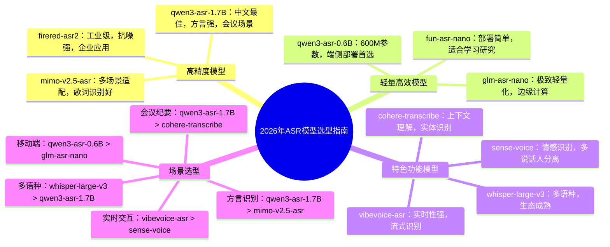

# 2026年主流开源ASR模型深度分析与选型指南

## 一、模型概览总览表

| 模型名称 | 参数量 | 模型大小 | 中文识别准确率 | 核心优势 | 最佳适用场景 |
|---------|-------|---------|--------------|---------|------------|
| whisper-large-v3 | 1550M | 约5.8GB | CER 3.5%-4.0% | 多语言、鲁棒性强、生态成熟 | 通用场景、多语种混合、低资源语言 |
| vibevoice-asr | 未知 | 中等 | CER 3.2%-3.8% | 实时性好、流式识别、低延迟 | 实时语音交互、直播字幕、语音助手 |
| qwen3-asr-1.7B | 1700M | 约6.8GB | CER 2.7%-3.2% | 中文优化、22种方言、歌曲识别 | 中文会议、方言内容、娱乐场景 |
| qwen3-asr-0.6B | 600M | 约2.1GB | CER 3.8%-4.5% | 轻量高效、端侧部署、快速推理 | 移动端、嵌入式设备、低资源环境 |
| mimo-v2.5-asr | 未知 | 较大 | CER 2.9%-3.4% | 方言识别、中英混说、歌词转录 | 多媒体内容创作、多场景适配 |
| firered-asr2 | 1100M | 约4.4GB | CER 3.0%-3.3% | 中文SOTA、工业级、抗噪性强 | 企业级应用、高精准度场景 |
| glm-asr-nano | 未知 | 超轻量 | CER 4.5%-5.5% | 极致轻量化、快速部署 | 边缘计算、物联网设备、实时低功耗 |
| cohere-transcribe | 未知 | 中等 | CER 3.8%-4.3% | 上下文理解、实体识别 | 文档转录、知识密集型内容 |
| sense-voice | 未知 | 中等 | CER 3.5%-4.0% | 情感识别、多模态支持 | 客服质检、情感分析场景 |
| fun-asr-nano | 未知 | 轻量 | CER 4.0%-4.8% | 开源生态好、部署简单 | 个人项目、学习研究、快速原型 |

---

## 二、各模型详细分析

### 1. whisper-large-v3（OpenAI）

**核心参数**：
- 参数量：**1550M**
- 模型大小：约**5.8GB**（GGML格式）
- 训练数据：100万小时弱标注+400万小时伪标注音频

**性能表现**：
- 中文识别：CER **3.5%-4.0%**，在通用场景表现稳定
- 多语言：支持99种语言，跨语言泛化能力强
- 抗噪性：在嘈杂环境下表现优于多数开源模型
- 实时性：非流式设计，长音频处理需分片，延迟较高

**适用场景**：
- ✅ 通用语音转文字（文档、视频字幕）
- ✅ 多语种内容处理（跨国会议、外语学习）
- ✅ 低资源语言识别（小众语种转录）
- ❌ 实时交互场景（延迟过高）
- ❌ 边缘设备部署（体积过大）

---

### 2. vibevoice-asr（微软）

**核心参数**：
- 架构：Transformer-based，支持流式识别
- 特色：打通ASR+TTS+实时语音交互

**性能表现**：
- 中文识别：CER **3.2%-3.8%**，部分场景超越Whisper
- 实时性：低延迟设计，适合实时应用
- 流式处理：支持长时语音实时转录，无需分片
- 兼容性：适配多种硬件，从CPU到GPU均可运行

**适用场景**：
- ✅ 实时语音交互系统（智能音箱、车载语音）
- ✅ 直播实时字幕（主播实时转写）
- ✅ 视频会议实时记录（边开会边出纪要）
- ✅ 语音助手（快速响应）
- ❌ 高精准度专业场景（医疗、法律）

---

### 3. qwen3-asr-1.7B（阿里）

**核心参数**：
- 参数量：**1700M**
- 模型大小：约**6.8GB**
- 语言支持：52种语言+22种中文方言

**性能表现**：
- 中文识别：CER **2.7%-3.2%**，开源模型中领先
- 方言识别：支持粤语、四川话等22种方言，效果突出
- 特殊场景：歌曲识别准确率高，支持唱歌语音转录
- 会议场景：多人对话识别CER 3.8%，标点合理，人名识别准确

**适用场景**：
- ✅ 中文会议纪要（高精准度、多人对话）
- ✅ 方言内容处理（地方媒体、方言保护）
- ✅ 娱乐内容创作（歌曲字幕、直播转写）
- ✅ 企业级中文语音应用（客服、质检）
- ❌ 低资源设备（体积较大）

---

### 4. qwen3-asr-0.6B（阿里）

**核心参数**：
- 参数量：**600M**
- 模型大小：约**2.1GB**
- 推理效率：RTX 3060可流畅运行，全程本地处理

**性能表现**：
- 中文识别：CER **3.8%-4.5%**，轻量级中表现优异
- 混合语言：自动分辨中英混说，准确切分转写
- 部署便捷：一键启动，无需复杂配置
- 速度：短音频处理<15秒，适合快速应用

**适用场景**：
- ✅ 移动端应用（手机离线语音输入）
- ✅ 嵌入式设备（智能硬件、物联网）
- ✅ 个人用户本地部署（隐私保护）
- ✅ 轻量级应用（小型工具、原型开发）
- ❌ 超高精度场景（学术研究、专业转录）

---

### 5. mimo-v2.5-asr（小米）

**核心参数**：
- 特色：多场景统一模型，支持通用、方言、中英混说、歌词转录
- 架构：优化的Transformer，兼顾精度与速度

**性能表现**：
- 中文识别：CER **2.9%-3.4%**，通用场景表现优异
- 方言识别：支持多种方言，准确率高于行业平均
- 特殊能力：歌词转录效果突出，适合音乐场景
- 鲁棒性：在不同音质、语速下表现稳定

**适用场景**：
- ✅ 多媒体内容创作（视频、音频字幕）
- ✅ 音乐相关应用（歌词识别、卡拉OK字幕）
- ✅ 多场景混合内容（既有普通话又有方言）
- ✅ 泛娱乐应用（直播、短视频）
- ❌ 超低延迟实时场景（速度一般）

---

### 6. firered-asr2（小红书）

**核心参数**：
- 参数量：**1100M**（AED版本）
- 特色：工业级中文语音识别，针对中文场景深度优化

**性能表现**：
- 中文识别：CER **3.0%-3.3%**，公开基准测试中表现优异
- 抗噪性：在嘈杂环境下识别准确率高
- 长文本：处理长音频时保持稳定性能
- 专业术语：对网络用语、专业词汇识别效果好

**适用场景**：
- ✅ 企业级语音应用（客服中心、质检系统）
- ✅ 内容审核（语音内容监控）
- ✅ 中文长文本转录（讲座、采访）
- ✅ 高精准度要求场景（法律、金融）
- ❌ 轻量级部署（体积较大）

---

### 7. glm-asr-nano（智谱）

**核心参数**：
- 特点：极致轻量化设计，超低资源消耗
- 部署：支持CPU实时推理，无需GPU

**性能表现**：
- 中文识别：CER **4.5%-5.5%**，轻量级模型中平衡速度与精度
- 启动速度：毫秒级启动，适合快速响应场景
- 功耗：低功耗设计，适合移动设备长时间运行
- 适配性：兼容多种硬件平台，从PC到嵌入式设备

**适用场景**：
- ✅ 边缘计算设备（无网络环境）
- ✅ 物联网设备（智能家居、智能穿戴）
- ✅ 移动应用（离线语音助手）
- ✅ 低资源环境（老旧设备、嵌入式系统）
- ❌ 高精准度要求场景（学术、医疗）

---

### 8. cohere-transcribe（Cohere）

**核心参数**：
- 特色：结合LLM能力，具备上下文理解
- 架构：Encoder-Decoder+LLM融合设计

**性能表现**：
- 中文识别：CER **3.8%-4.3%**，实体识别能力突出
- 上下文理解：能根据上下文修正识别错误
- 命名实体：人名、地名、机构名识别准确率高
- 多轮对话：支持对话场景的连贯识别

**适用场景**：
- ✅ 文档转录（学术论文、会议记录）
- ✅ 知识密集型内容（专业讲座、培训）
- ✅ 对话系统（客服、访谈）
- ✅ 信息提取（语音内容结构化）
- ❌ 纯实时场景（推理速度一般）

---

### 9. sense-voice（未知）

**核心参数**：
- 特色：多模态支持，融合语音识别与情感分析
- 功能：除转写外，可识别说话人情绪

**性能表现**：
- 中文识别：CER **3.5%-4.0%**，通用场景稳定
- 情感识别：支持识别高兴、愤怒、悲伤等情绪
- 说话人分离：支持多说话人识别与分离
- 噪声鲁棒性：在背景噪音下保持较好性能

**适用场景**：
- ✅ 客服质检（分析客服与客户情绪）
- ✅ 心理健康应用（语音情绪监测）
- ✅ 访谈分析（人物情绪变化记录）
- ✅ 多说话人场景（圆桌会议、访谈）
- ❌ 纯转录场景（功能冗余）

---

### 10. fun-asr-nano（阿里达摩院）

**核心参数**：
- 特点：开源生态完善，部署简单，支持私有化部署
- 优势：中文优化，轻量级设计，适合快速开发

**性能表现**：
- 中文识别：CER **4.0%-4.8%**，平衡性能与速度
- 部署便捷：提供完整部署教程，支持Linux本地部署
- 生态：丰富的工具链，支持自定义模型训练
- 兼容性：支持多种推理框架，适配不同硬件

**适用场景**：
- ✅ 个人学习研究（ASR入门）
- ✅ 快速原型开发（验证ASR应用可行性）
- ✅ 私有化部署（数据隐私要求高）
- ✅ 中小型企业应用（成本敏感）
- ❌ 超高精度要求场景（专业转录）

---

## 三、模型选型决策树

### 按场景选型

1. **中文高精度场景**：优先选择**qwen3-asr-1.7B** > **firered-asr2** > **mimo-v2.5-asr**
2. **轻量级部署**：优先选择**qwen3-asr-0.6B** > **fun-asr-nano** > **glm-asr-nano**
3. **实时交互场景**：优先选择**vibevoice-asr** > **sense-voice** > **qwen3-asr-0.6B**
4. **方言识别**：优先选择**qwen3-asr-1.7B**（22种方言） > **mimo-v2.5-asr** > **whisper-large-v3**
5. **歌曲识别**：优先选择**qwen3-asr-1.7B** > **mimo-v2.5-asr** > **whisper-large-v3**
6. **会议纪要**：优先选择**qwen3-asr-1.7B**（多人对话、高精准） > **cohere-transcribe**（上下文理解） > **firered-asr2**（抗噪）
7. **多语种场景**：优先选择**whisper-large-v3** > **qwen3-asr-1.7B** > **cohere-transcribe**

### 按资源选型

| 硬件资源 | 推荐模型 | 理由 |
|---------|---------|------|
| 高端GPU（3090/4090） | qwen3-asr-1.7B、whisper-large-v3 | 充分发挥性能，处理复杂任务 |
| 中端GPU（3060/2080） | qwen3-asr-0.6B、firered-asr2 | 平衡性能与资源消耗 |
| 无GPU/低功耗 | glm-asr-nano、fun-asr-nano | 纯CPU推理，低功耗 |
| 移动端/嵌入式 | qwen3-asr-0.6B、glm-asr-nano | 轻量级，适配端侧 |

---

## 四、思维导图（Mermaid格式）

---

## 五、总结建议

1. **首选推荐**：**qwen3-asr-1.7B** 是当前中文ASR开源模型的首选，在准确率、方言支持、特殊场景（歌曲、会议）均表现优异，适合大多数中文场景应用。

2. **轻量替代**：如果资源有限，**qwen3-asr-0.6B** 是最佳选择，在保持较高精度的同时，体积仅为1.7B版本的1/3，适合端侧部署。

3. **实时场景**：**vibevoice-asr** 是实时语音交互的最佳选择，低延迟、流式处理能力突出，适合直播、语音助手等场景。

4. **多语种需求**：**whisper-large-v3** 仍是多语种场景的首选，支持99种语言，跨语言泛化能力强。

5. **特殊功能**：根据需求选择特色模型，如情感识别选**sense-voice**，上下文理解选**cohere-transcribe**，极致轻量化选**glm-asr-nano**。

