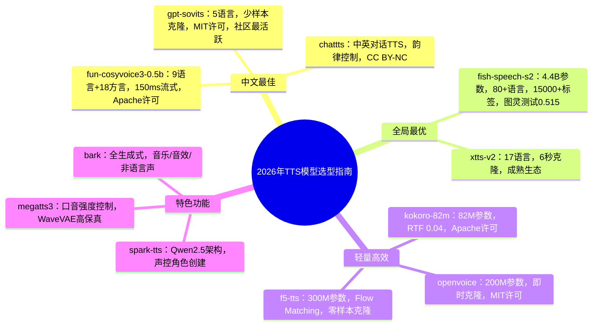

# 2026年主流开源TTS模型深度分析与选型指南

## 一、模型概览总览表

| 模型名称 | 参数量 | 模型大小 | 语言支持 | 音质（MOS） | 核心优势 | 最佳适用场景 |
|---------|-------|---------|---------|------------|---------|------------|
| kokoro-82m | 82M | 约0.3GB | 8种语言+54声 | 4.0-4.3 | 极致轻量、推理极快、Apache许可 | 嵌入式设备、移动端、低成本部署 |
| chattts | ~200M | 约1.0GB | 中英双语 | 3.8-4.2 | 对话式TTS、韵律控制、笑声生成 | LLM助手、聊天机器人、对话场景 |
| fun-cosyvoice3-0.5b | 500M | 约1.0GB | 9语言+18方言 | 4.2-4.5 | 中文最佳、流式150ms、指令控制 | 中文语音助手、实时交互、多方言 |
| fish-speech-s2 | 4.4B | 约8.8GB | 80+语言 | 4.3-4.6 | 全局最优、15000+标签、RL对齐 | 高端语音合成、多语言、情感控制 |
| f5-tts | 300M | 约0.6GB | 中英（可扩展） | 4.0-4.3 | 零样本克隆、Flow Matching | 快速语音克隆、多风格合成 |
| gpt-sovits | ~300M | 约0.6GB | 中英日韩粤 | 3.8-4.2 | 少样本克隆、社区活跃、微调便捷 | 个性化语音、角色配音、二次元 |
| spark-tts | 500M | 约1.0GB | 中英双语 | 4.0-4.3 | Qwen2.5架构、声控生成、零样本克隆 | 语音克隆、声控角色创建 |
| megatts3 | 450M | 约0.9GB | 中英双语 | 4.0-4.3 | 口音控制、高保真克隆、WaveVAE | 口音语音、跨语言克隆 |
| xtts-v2 | ~1.2B | 约2.1GB | 17种语言 | 3.8-4.1 | 多语言克隆、6秒参考音频 | 多语言应用、跨语言克隆 |
| bark | ~1.0B | 约3.4GB | 13种语言 | 3.5-4.0 | 全生成式、音乐/音效/非语言声 | 创意音频、音乐生成、非语言声 |
| openvoice | ~200M | 约0.4GB | 6种语言 | 3.8-4.1 | 即时音色克隆、风格控制、MIT许可 | 即时语音克隆、风格迁移 |

---

## 二、各模型详细分析

### 1. kokoro-82m（hexgrad）

**核心参数**：
- 参数量：**82M**（极轻量）
- 模型大小：约**0.3GB**（FP32）
- 架构：StyleTTS 2 + ISTFTNet，仅解码器，无扩散/无编码器
- 许可证：Apache 2.0（可商用）
- 训练成本：约$1000（1000小时 A100 80GB）
- 语言：8种语言（英/中/日/韩/法/等）+ 54种预设音色

**性能表现**：
- 音质：MOS **4.0-4.3**，82M参数中达到顶级水平
- 推理速度：RTF ~0.04（L20 GPU），极快
- 自然度：韵律自然，接近人类水平
- API成本：低于$1/百万字符（市场最低之一）
- 限制：中文音色和质量弱于英文，零样本克隆能力有限

**适用场景**：
- ✅ 嵌入式设备/移动端部署（82M参数，极小）
- ✅ 低成本商业API部署（Apache许可）
- ✅ 实时语音交互（推理极快）
- ✅ 资源受限环境（Jetson、树莓派等）
- ❌ 高质量中文语音（中文效果一般）
- ❌ 零样本语音克隆（无此功能）

---

### 2. chattts（2Noise）

**核心参数**：
- 参数量：约**200M**
- 模型大小：约**1.0GB**（FP32）
- 架构：自回归Transformer + VQ-VAE，对话场景优化
- 许可证：代码AGPL-3.0，模型CC BY-NC 4.0（仅学术用途）
- 训练数据：开源版本为40,000小时预训练（未SFT）

**性能表现**：
- 中文音质：MOS **3.8-4.2**，对话场景自然度高
- 韵律控制：支持细粒度控制，包括笑声[laugh]、停顿[uv_break]、口语[oral_n]
- 多说话人：支持随机采样说话人嵌入，可保存复用
- 限制：自回归模型稳定性差，可能出现多说话人/音质下降；需4GB VRAM

**适用场景**：
- ✅ LLM助手对话语音（自然韵律、笑声插入）
- ✅ 聊天机器人（对话式TTS优化）
- ✅ 播客/有声书生成
- ❌ 商业用途（CC BY-NC许可）
- ❌ 高稳定性要求场景（自回归不稳定）

---

### 3. fun-cosyvoice3-0.5b（阿里达摩院）

**核心参数**：
- 参数量：**500M**（0.5B）
- 模型大小：约**1.0GB**（BF16）
- 架构：LLM + Flow Matching + HiFiGAN vocoder，支持监督语义token
- 许可证：Apache 2.0（可商用）
- 语言：9种语言 + 18+种中文方言/口音
- 版本：CosyVoice3-0.5B-2512（含RL版本）

**性能表现**：
- 中文合成准确率：CER **0.81%**（RL版本），开源最佳之一
- 说话人相似度：**78.0%**（base）/ **77.4%**（RL），开源领先
- 英文WER：**1.68%**（RL版本）
- 流式延迟：低至**150ms**（双向流式：文本流入+音频流出）
- 指令控制：支持语言、方言、情感、语速、音量等指令
- 拼音注入：支持中文拼音和英文CMU音素注入，可控性强
- 文本规范化：无需前端模块即可处理数字、符号等

**适用场景**：
- ✅ 中文语音助手（中文效果开源最佳）
- ✅ 实时语音交互（150ms流式延迟）
- ✅ 多方言应用（18+方言）
- ✅ 企业级部署（Apache许可，vLLM/TensorRT加速）
- ✅ 语音克隆（零样本跨语言克隆）
- ❌ 超轻量部署（500M参数）

---

### 4. fish-speech-s2（Fish Audio）

**核心参数**：
- 参数量：**4.4B**（慢AR 4B + 快AR 400M）
- 模型大小：约**8.8GB**（BF16）
- 架构：双自回归（Dual-AR）架构 + RVQ音频编解码（10码本，~21Hz）
- 许可证：Fish Audio Research License（研究用途，商用需授权）
- 语言：80+语言（Tier1: 日/英/中，Tier2: 韩/西/葡/阿/俄/法/德）
- RL对齐：GRPO强化学习后训练

**性能表现**：
- 中文WER：**0.54%**（Seed-TTS Eval，所有模型最佳）
- 英文WER：**0.99%**（Seed-TTS Eval，所有模型最佳）
- 说话人相似度：17/24语言最佳SIM
- 人类图灵测试：0.515后验均值，超越Seed-TTS 24%
- EmergentTTS胜率：**81.88%**（最高）
- 推理速度：RTF **0.195**（H200 GPU），TTFA **~100ms**
- 细粒度控制：**15,000+标签**（如[whisper], [excited], [angry], [singing]等）
- 多说话人生成：单次生成支持多说话人
- 多轮对话：利用上文信息提升后续内容自然度

**适用场景**：
- ✅ 高端语音合成（全局最优）
- ✅ 情感/风格精细控制（15000+标签）
- ✅ 多语言应用（80+语言）
- ✅ 快速语音克隆（10-30秒参考音频）
- ✅ SGLang/vLLM加速（3,000+ tokens/s）
- ❌ 低资源部署（8.8GB，需高端GPU）
- ❌ 商用（Research License需授权）

---

### 5. f5-tts（SWivid）

**核心参数**：
- 参数量：约**300M**（Diffusion Transformer + ConvNeXt V2）
- 模型大小：约**0.6GB**（FP32）
- 架构：Flow Matching + Diffusion Transformer，Sway Sampling推理策略
- 许可证：代码MIT，模型CC-BY-NC 4.0（仅学术用途）
- 语言：中英（基于Emilia数据集，可扩展）

**性能表现**：
- 中文CER：**1.52%**，说话人相似度**74.1%**
- 英文WER：**2.00%**，说话人相似度**64.7%**
- 零样本克隆：单句参考音频即可克隆
- 推理速度：RTF **0.04**（L20 + Vocos，batch=1）
- TensorRT-LLM加速：RTF降至**0.1467**（离线模式）
- 多风格/多说话人：支持Gradio界面多风格生成
- 语音聊天：内置Qwen2.5-3B驱动的语音聊天功能

**适用场景**：
- ✅ 快速语音克隆（零样本）
- ✅ 多风格/多说话人合成
- ✅ 个人研究/学习（MIT代码许可）
- ❌ 商业用途（CC-BY-NC模型许可）
- ❌ 高质量流式推理（扩散模型需多步）

---

### 6. gpt-sovits（RVC-Boss）

**核心参数**：
- 参数量：约**300M**（GPT ~200M + SoVITS ~100M）
- 模型大小：约**0.6GB**（不含BigVGAN vocoder）
- 架构：GPT语义建模 + SoVITS声学模型 + BigVGAN vocoder
- 许可证：MIT（可商用）
- 语言：中/英/日/韩/粤语（5种）
- 版本：V4（2025）最新，原生48kHz输出

**性能表现**：
- 推理速度：RTF **0.028**（4060Ti），**0.014**（4090），**0.526**（M4 CPU）
- 少样本克隆：1分钟训练数据即可高质量克隆
- 零样本克隆：5秒参考音频即可
- 微调便捷：WebUI全流程（分离→切片→降噪→ASR→标注→训练→推理）
- 社区：58.6k Stars，最活跃的开源TTS社区
- V4改进：修复V3金属感伪影，原生48kHz输出，音色相似度提升

**适用场景**：
- ✅ 个性化语音克隆（少样本微调）
- ✅ 角色/虚拟人配音（二次元、游戏角色）
- ✅ 本地部署（MIT许可，CPU可运行）
- ✅ 持续迭代的社区生态
- ❌ 超高质量多语言（仅5种语言）
- ❌ 纯零样本克隆质量（不如CosyVoice3/Fish-S2）

---

### 7. spark-tts（SparkAudio/字节跳动）

**核心参数**：
- 参数量：**500M**（0.5B）
- 模型大小：约**1.0GB**
- 架构：基于Qwen2.5的单流解耦语音token，无额外生成模型
- 许可证：CC BY-NC-SA 4.0（原Apache 2.0，因训练数据许可更新）
- 语言：中英双语

**性能表现**：
- 中文CER：**1.2%**，说话人相似度**66.0%**
- 英文WER：**1.98%**，说话人相似度**57.3%**
- 零样本克隆：支持跨语言和码切换场景
- 声控生成：通过调整性别、音高、语速参数创建虚拟说话人
- 推理速度：RTF **0.07-0.14**（L20 GPU，TensorRT-LLM）
- 简洁高效：无需flow matching等额外模型，直接从LLM预测重建音频

**适用场景**：
- ✅ 语音克隆（零样本跨语言）
- ✅ 声控角色创建（性别/音高/语速可调）
- ✅ 简洁架构部署（Qwen2.5生态）
- ❌ 商业用途（CC BY-NC-SA许可）
- ❌ 多语言需求（仅中英）

---

### 8. megatts3（字节跳动）

**核心参数**：
- 参数量：**450M**（Diffusion Transformer主干0.45B）+ WaveVAE
- 模型大小：约**0.9GB**（含WaveVAE）
- 架构：稀疏对齐增强的Latent Diffusion Transformer + WaveVAE声码器
- 许可证：Apache 2.0（可商用）
- 语言：中英双语，支持码切换

**性能表现**：
- 零样本克隆：高保真音色克隆，上传参考音频+预提取latents
- 口音控制：支持口音强度控制（p_w参数），跨语言口音调节
- 智能度/相似度权衡：p_w控制清晰度，t_w控制相似度
- CPU推理：约30秒/条（10步推理）
- WaveVAE：将24kHz语音压缩至25Hz声学latent，几乎无损重建
- 子模块：包含强制对齐器、字素-音素模型（Qwen2.5-0.5B微调）

**适用场景**：
- ✅ 口音语音合成（独特口音控制能力）
- ✅ 跨语言语音克隆
- ✅ 高保真克隆（WaveVAE声码器）
- ✅ Apache许可商用
- ❌ 实时推理（扩散模型多步推理慢）
- ❌ WaveVAE编码器未开源（需预提取latents）

---

### 9. xtts-v2（Coqui）

**核心参数**：
- 参数量：约**1.2B**
- 模型大小：约**2.1GB**（model.pth 1.87GB + dvae.pth 211MB）
- 架构：GPT + DVAE + HiFiGAN，多语言多数据集训练
- 许可证：Coqui Public Model License（CPML，可商用需遵守条款）
- 语言：17种语言（英/西/法/德/意/葡/波/土/俄/荷/捷/阿/中/日/匈/韩/印地）

**性能表现**：
- 语音克隆：仅需6秒参考音频即可克隆
- 跨语言克隆：支持跨语言语音克隆
- 情感/风格迁移：通过参考音频转移情感和风格
- 采样率：24kHz
- 多说话人参考：支持多说话人参考+说话人插值
- 成熟生态：Coqui TTS工具链完整，文档完善

**适用场景**：
- ✅ 多语言语音克隆（17种语言）
- ✅ 跨语言克隆（中文参考→英文输出）
- ✅ 成熟生态快速集成
- ❌ 中文质量不如专门优化模型
- ❌ Coqui公司已关闭，社区维护
- ❌ 推理速度较慢

---

### 10. bark（Suno）

**核心参数**：
- 参数量：约**1.0B**（3个Transformer：文本→语义/语义→粗/粗→细，各约300M）
- 模型大小：约**3.4GB**（完整版）/ ~1.5GB（小版）
- 架构：全生成式GPT + EnCodec，3阶段级联
- 许可证：MIT（可商用）
- 语言：13种语言
- 特殊：不仅是TTS，而是文本→音频生成模型

**性能表现**：
- 生成能力：可生成语音、音乐、背景噪声、音效
- 非语言声：[laughter] [sighs] [gasps] [clears throat] ♪歌词♪ 等
- 多语言：自动检测语言，支持口音（如德语口音的英语）
- VRAM需求：完整版~12GB，小版~8GB，CPU offload可降至~2GB
- 输出长度：默认~13秒，长文本需分片拼接
- 限制：自回归模型，输出可能与提示偏离；无法自定义语音克隆

**适用场景**：
- ✅ 创意音频生成（音乐/音效/非语言声）
- ✅ 多语言语音+环境声合成
- ✅ 研究/实验用途
- ❌ 高质量纯TTS（不如专业TTS模型）
- ❌ 实时应用（推理慢，13秒限制）
- ❌ 自定义语音克隆（不支持）

---

### 11. openvoice（MyShell/MIT）

**核心参数**：
- 参数量：约**200M**（基于VITS/VITS2）
- 模型大小：约**0.4GB**
- 架构：音色克隆器 + 基础TTS模型（VITS2），解耦音色和风格
- 许可证：MIT（可商用）
- 语言：V2支持6种语言（英/西/法/中/日/韩）

**性能表现**：
- 即时克隆：音色克隆无需训练，即时推理
- 风格控制：可独立控制情感、口音、节奏、停顿、语调
- 跨语言克隆：参考语音和生成语音无需在同语言训练数据中
- 音质：V2版本音质优于V1
- 生态：已被MyShell.ai使用数千万次

**适用场景**：
- ✅ 即时语音克隆（MIT许可）
- ✅ 风格/情感迁移
- ✅ 跨语言克隆
- ✅ 轻量部署
- ❌ 高保真音质（不如大模型）
- ❌ 多语言覆盖（仅6种）
- ❌ 中文质量一般

---

## 三、模型选型决策树

### 按场景选型

1. **中文语音助手/实时交互**：优先选择**fun-cosyvoice3-0.5b** > **kokoro-82m** > **gpt-sovits**
2. **零样本语音克隆**：优先选择**fish-speech-s2** > **fun-cosyvoice3-0.5b** > **f5-tts**
3. **少样本个性化克隆**：优先选择**gpt-sovits** > **f5-tts** > **openvoice**
4. **多语言应用**：优先选择**fish-speech-s2**（80+语言） > **xtts-v2**（17语言） > **bark**（13语言）
5. **情感/风格精细控制**：优先选择**fish-speech-s2**（15000+标签） > **fun-cosyvoice3-0.5b** > **openvoice**
6. **嵌入式/移动端**：优先选择**kokoro-82m** > **openvoice** > **gpt-sovits**（CPU模式）
7. **创意音频生成**：优先选择**bark**（非语言声/音乐） > **fish-speech-s2** > **chattts**
8. **口音/方言控制**：优先选择**megatts3** > **fun-cosyvoice3-0.5b** > **spark-tts**

### 按资源选型

| 硬件资源 | 推荐模型 | 理由 |
|---------|---------|------|
| 高端GPU（3090/4090/H200） | fish-speech-s2、fun-cosyvoice3-0.5b | 充分发挥性能，最高音质 |
| 中端GPU（3060/2080） | fun-cosyvoice3-0.5b、f5-tts、gpt-sovits、spark-tts | 平衡音质与资源 |
| 无GPU/CPU推理 | kokoro-82m、gpt-sovits（CPUFast）、openvoice | 纯CPU可运行 |
| 嵌入式/移动端 | kokoro-82m（82M参数） | 极致轻量 |

### 按许可选型

| 许可类型 | 可商用模型 | 仅学术模型 |
|---------|-----------|-----------|
| Apache 2.0 / MIT | kokoro-82m、fun-cosyvoice3-0.5b、gpt-sovits、megatts3、bark、openvoice | - |
| CC BY-NC | - | chattts、f5-tts、spark-tts |
| 研究许可 | - | fish-speech-s2（需授权商用） |
| CPML | xtts-v2（遵守条款可商用） | - |

---

## 四、思维导图（Mermaid格式）

---

## 五、总结建议

1. **首选推荐**：**fun-cosyvoice3-0.5b** 是当前中文TTS开源模型的首选，在中文合成准确率、说话人相似度、流式延迟、方言覆盖均表现优异，Apache许可可商用，适合大多数中文场景。

2. **全局最优**：如果追求极致音质和功能，**fish-speech-s2** 是当前开源TTS的天花板，80+语言、15000+情感标签、图灵测试0.515，但需高端GPU且商用需授权。

3. **极致轻量**：**kokoro-82m** 仅82M参数，推理速度极快（RTF 0.04），Apache许可，是嵌入式和移动端的不二之选，但中文效果一般。

4. **个性化克隆**：**gpt-sovits** 凭借1分钟数据微调即可高质量克隆的特性和最活跃的社区生态，是个性化语音克隆的最佳选择。

5. **特色功能**：根据需求选择特色模型，如口音控制选**megatts3**，创意音频选**bark**，即时克隆选**openvoice**，声控角色选**spark-tts**。
